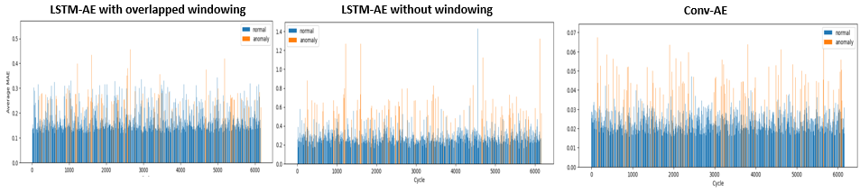

# Anomaly Detection using LSTM-based Auto-Encoder for Multivariate Time-Series
This project is aimed at implementing an LSTM-based auto-encoder for anomaly detection in multivariate and potentially cyclic time-series data. The dataset used in this project is from the field of semiconductor manufacturing and contains online process control measurements recorded by various sensors during the processing of silicon wafers. The dataset has been preprocessed and contains both normal and abnormal process samples. However, the focus of this project is not on the specific domain or physical process being monitored, but rather on developing a reproducible code for anomaly detection in multivariate and cyclic time-series.

## Auto-Encoders
Auto-encoders are neural networks that aim to reconstruct their input data, which are often images or sequences. They consist of two main parts: an encoder, which maps the input data to a lower-dimensional latent space representation, and a decoder, which maps the latent space representation back to the input data. During training, the network is trained to minimize the reconstruction error between the input data and the reconstructed data, often using mean squared error (MSE) as the loss function. Once the network is trained, it can be used to reconstruct new data, and the reconstruction error can be used as a measure of anomaly score.

## Dataset
The "Wafer" dataset used in this project was formatted by Robert Olszewski as part of his doctoral thesis. It contains online process control measurements recorded by various sensors during the processing of silicon wafers for semiconductor manufacturing. The dataset contains both normal and abnormal process samples. There is a significant class imbalance, with abnormal samples representing 10.7% of the training set and 12.1% of the test set. The variables recorded by the sensors are not explicitly labeled and are likely a combination of multiple variables.

## Normal cycle vs anomaly

 

## Cycle windowing with overlap
In order to boost the encoding of temporal dependency, a good practice in LSTM data preprocessing is to segment the sequences into windows with overlap. We applied this method by using a subsequence length of 12 and a gap of 4 for each cycle of length 152 for the wafer dataset usecase.

 

## Training and validation loss functions (MAE)
**To remind you: The auto-encoder was trained solely on the normal cycles available in the training set. None of the anomlies were introduced during training!**

 

## Reconstructed cycle
By applying the auto-encoder on the training set, we obtain a windowed reconstruction with overlaps. In order to get rid of the overlap by keeping maximum information, I have applied an average over every overlap and obtained the below reconstruction.

 

## Anomaly detection
To identifies anomalies, we will calculate the MAE per cycle using the reconstructed cycles. In principles, the model will struggle at reconstructing anomalies at least slightly more than with normal cycles since they are less familiar with them.

 

## Getting Started
To use this repository, you'll need to have the following prerequisites installed:

- Python 3  
- NumPy  
- TensorFlow  

You can install the dependencies using pip:

          pip install -r requirements.txt
        
## References
- Olszewski, R. T. "Generalized feature extraction for structural pattern recognition in time-series data". No. CMU-CS-01-108. Carnegie Mellon University, School of Computer Science, 2001. [URL](https://dl.acm.org/citation.cfm?id=935627)  
- Malhotra, P., Vig, L., Shroff, G., & Agarwal, P. (2016). LSTM-based encoder-decoder for multi-sensor anomaly detection. arXiv preprint arXiv:1607.00148.
